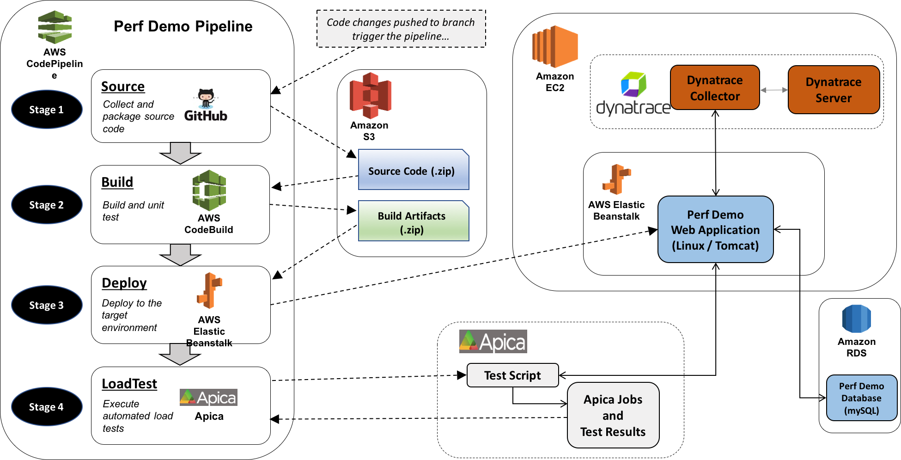
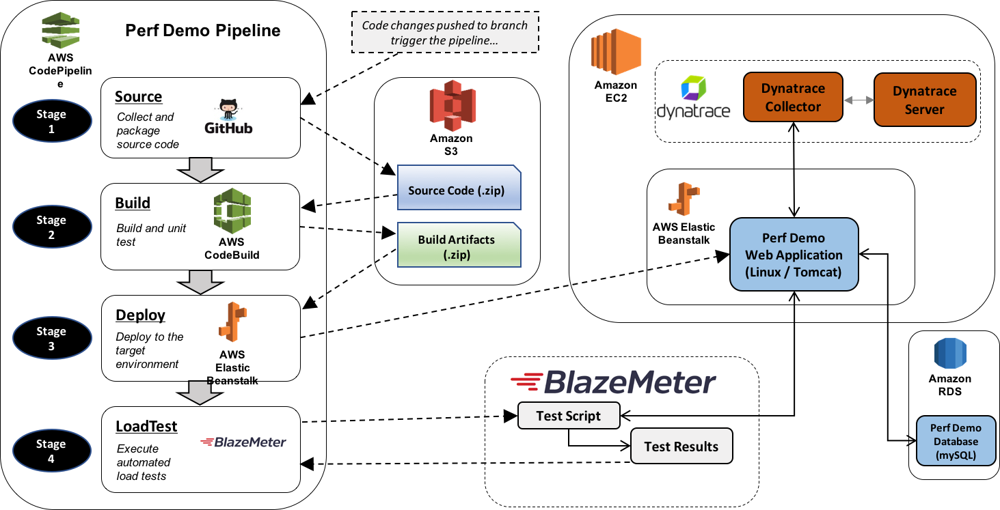

# perf-demo
[Travis CI](https://travis-ci.org) Build Status: 

Perf-Demo is a simple web application that defines a set of RESTful web services containing common performance issues. There are two versions of each service. Version 1 contains the performance issue and version 2 implements the same service with the performance issue resolved.

The project currently contains the following performance issues:

1. Synchronous vs. Asynchronous Processing
2. Memory Leaks
3. N+1 Database Query Issue

_The project was used in a performance webinar demonstrating deployment of an application via AWS CodePipeline and utilizing Dynatrace AppMon and Apica LoadTest. The slide deck from the webinar can be found in the docs folder and a recording of the presentation can be found here: [Online Perf Clinic – Scaling DevOps Deployments with AWS CodePipeline and Dynatrace AppMon](https://youtu.be/tb4xJ5im8jw?list=PLqt2rd0eew1bmDn54E2_M2uvbhm_WxY_6)_

_UPDATE (4/20/2017) - The project was also used in a presentation for the CMG Boston Spring meeting ([link](https://www.cmg.org/regions/greater-boston-cmg/)). In the CMG presentation, BlazeMeter was used for the load testing instead of Apica LoadTest._

